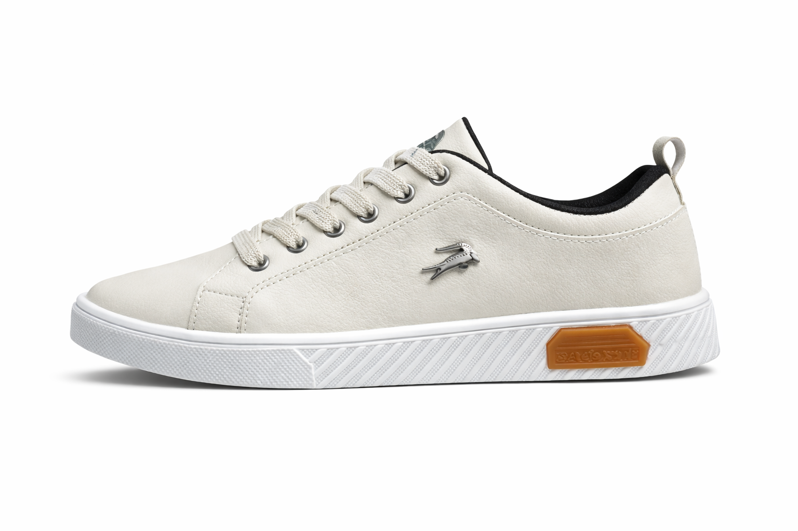

# 3lCangryLHR
# 🛍️ The Cangry Club


 

🌐 **Live Website**\
https://thecangryclub.github.io

------------------------------------------------------------------------

# 📌 Project Overview

**The Cangry Club** is a lightweight sneaker catalog and online shop
interface focused on speed, simplicity, and usability.

The project is built entirely using **HTML, CSS, and Vanilla
JavaScript**, avoiding heavy frameworks to keep performance extremely
fast and the codebase easy to maintain.

The platform allows users to browse sneakers, search products instantly,
and filter items dynamically.

------------------------------------------------------------------------

# 🚀 Main Features

## 🔎 Real‑Time Product Search

The website includes a live search system that filters sneakers
instantly as the user types.

Search can match:

• Brand names\
• Product names\
• Visible product text

This makes product discovery fast and intuitive.

------------------------------------------------------------------------

## 🎯 Dynamic Filtering System

Products can be filtered using custom HTML attributes.

Example:

``` html
<article class="sneaker" data-brand="lacoste" data-size="38,39,40,41,42">
```

This allows filtering by:

• Brand\
• Available sizes

All filtering is handled by **pure JavaScript** without external
libraries.

------------------------------------------------------------------------

## 🧠 Smart Section Hiding

When a user performs a search, the interface automatically hides
non‑relevant sections such as:

• Collection banners\
• Promotional sections\
• Category highlights

Only relevant products remain visible, creating a cleaner browsing
experience.

------------------------------------------------------------------------

## ⚠️ Automatic "Product Not Found" Message

If the search produces zero results, the system displays a user‑friendly
message instead of leaving the page empty.

Example:

> No products found matching your search.

This improves usability and prevents confusion.

------------------------------------------------------------------------

## 🏷️ Product Badges

Sneakers can display visual badges such as:

• **New** • **Sale** • **Hot**

Example:

``` html
<span class="badge">New</span>
```

These help highlight featured or promotional products.

------------------------------------------------------------------------

# 📦 Product Structure

Each product follows a consistent structure:

``` html
<article class="sneaker" data-brand="lacoste" data-size="38,39,40,41,42">

<span class="badge">New</span>



<span class="sneaker__name">LACOSTE</span>

<span class="sneaker__name">Talles:</span>

<span class="nav__link">38 al 42</span>

<span class="sneaker__preci">$35.000</span>

<a href="shop.html" class="button">Ir a Shop!</a>

</article>
```

This structure ensures filters and search work automatically.

------------------------------------------------------------------------

# 🧰 Technologies Used

Core technologies used in the project:

• **HTML5** • **CSS3** • **JavaScript (Vanilla JS)** • **GitHub Pages**
for deployment

The goal is to maintain:

⚡ fast loading\
📱 mobile compatibility\
🧩 easy maintenance

------------------------------------------------------------------------

# 📁 Project Structure

    project-root
    │
    ├── index.html
    ├── shop.html
    │
    ├── css
    │   └── styles.css
    │
    ├── js
    │   └── main.js
    │
    └── statihttp://192.168.1.132:8000/README.mdc
        └── img

------------------------------------------------------------------------

# 🛠️ Planned Improvements

Future updates planned for the project:

• Automatic product counter\
• Advanced filtering system\
• Improved mobile UI\
• Performance optimization\
• Visual redesign\
• Inventory / stock indicators

------------------------------------------------------------------------

# 🌍 Deployment

The website is deployed using **GitHub Pages**.

Visit the live version:

https://thecangryclub.github.io

------------------------------------------------------------------------

# 🤝 Contribution

This project is currently maintained internally but may expand with
additional improvements such as:

• UI/UX enhancements\
• Performance optimization\
• New store features

------------------------------------------------------------------------

# 📄 License

Private project developed for **The Cangry Club**.

All rights reserved.

------------------------------------------------------------------------

# 👑 Author

Developed by

**3lC4ngryLHR**
